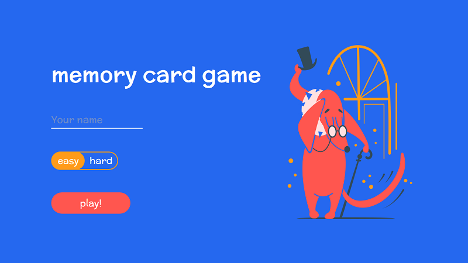
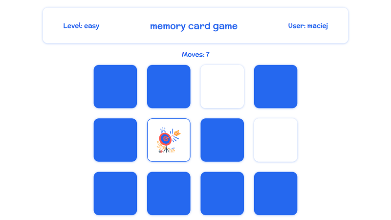

# React memory game

> Simple memory game made with React.js. Done as a training project, mostly to learn how to use React Hooks :)

### [Live demo](https://maciejkorolik.github.io/react-memory-game/)

 

## Setup

In the project main directory:

1.  `npm install` to install all needed packages
2.  `npm start` to run a development server. The app will run by default on localhost:3000

## Credits

- Design by Klaudia Sziller
- Illustrations by [Olga Nesnova](https://icons8.com/ouch/style/kingdom)
